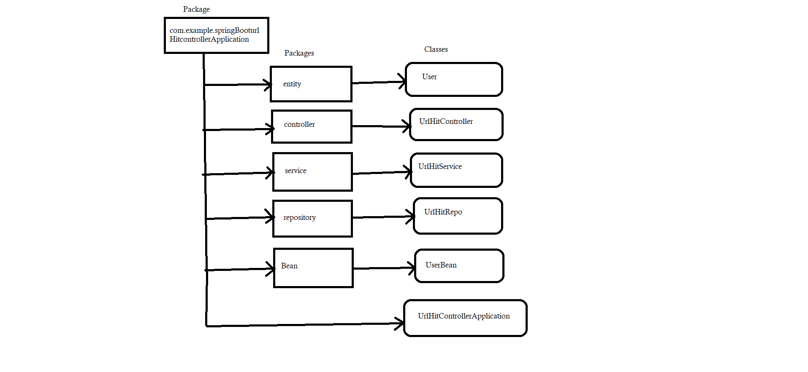

## Frameworks and language used 
* SpringBoot Framework and java language.
## Data Flow

## Data Structure used in your project
* Arraylist
## Project Summary

This is the "URL Hit Controller" Application which following the mvc-Architecture. I have created a package of springBooturlHitControllerApplication within this package I have created Five more packages to define layer as given in DFD. In this project a User has specific UserName.I have instantiated a hitCount variable by 0 And created getHitCount method in urlHitService class to increament its count by one by hitting on send button on client / postman and just returning this method in controller class by calling this method using endpoint like @GetMapping with some API name .That's the whole project meant. 

